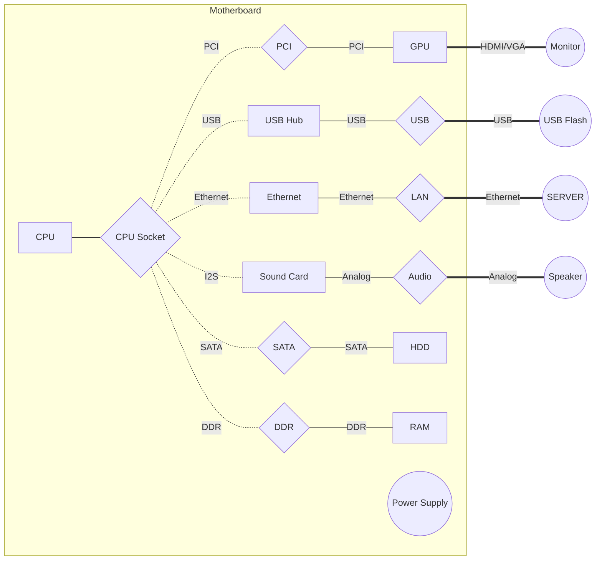

# Class Motherboard

---
[TOC]
---

## Структурная схема материнской платы

---

## Описание элементов материнской платы

    Устройства на плате
|Условное обозначение|Краткое описанеи|
|---|---|
CPU Socket|Разъём подключения центрального процессора
DDR|Разъём подключения планок оперативной памяти
SATA|Разъём подключения HDD
PCI|Разъём подключения PCI устройств
Sound Card|Микросхема звуковой карты
USB Hub|Микросхема USB хаба
Ethernet|Микросхема Ethernet модема

    Периферийные устройства
|Условное обозначение|Краткое описанеи|
|---|---|
CPU|Чип центрального процессора
GPU|Видеокарта
HDD|Жёсткий диск
RAM|Планки оперативной памяти
Power Supply|Блок питания

    Внешние устройства
|Условное обозначение|Краткое описанеи|
|---|---|
USB Flash|USB флешка (пусть будут только флешки)
SERVER|Локальный сервер
Monitor|Монитор
Speaker|Колонки

---

## Ограничения и характиристики устройств

>
    Материнская плата
> Требования материнской платы исходят из возможностей CPU

* CPU Socket
    - Тип сокета : `1180` `222` `420YOLO`
* DDR
    - Семейство : `DDR2` `DDR3` `DDR4`
    - Частота : `2000Mhz` `2666Mhz` `1200Mhz`
* SATA
    - Интерфейс подключения : `SATA 2.0` `SATA 3.0`
* PCI
    - Ширина шины : `64Bit` `128Bit` `256Bit`
* Sound Card
    - Поддержка каналов звука : `2.0` `4.0` `5.0`
* USB Hub
    - Поддержка протокола : `USB 2.0` `USB 3.0`
* Ethernet
    - Поддержка стандарта : `10Mbit` `100Mbit` `1Gbit`

>
    Периферийные устройства
> К CPU возлагаются требования только на тип сокета при попытки подключения к материнской плате

* CPU
    - Производитель : `AMD` `Intel` `ZalupaKonya`
    - Тип сокета : `1180` `222` `420YOLO`
    - Количество ядер : `2` `4` `6`
    - Частота ядра : `2Ghz` `3.8Ghz` `6.4Ghz`
    - Потребляемая мощность : `100W` `22W` `66W`
* GPU
    - Производитель : `GeForce` `Radeon` `ZalupaKonya`
    - Ширина шины : `64Bit` `128Bit` `256Bit`
    - Видеопамять: `2Gb` `4Gb` `6Gb`
    - Поддержка интерфейсов : `VGA` `DVI` `HDMI`
    - Потребляемая мощность : `100W` `22W` `66W`
* HDD
    - Производитель : `Kingston` `Samsung` `ZalupaKonya`
    - Интерфейс подключения : `SATA 2.0` `SATA 3.0`
    - Объём памяти : `100Gb` `222Gb` `1Tb`
    - Потребляемая мощность : `100W` `22W` `66W`
* RAM
    - Производитель : `Kingston` `Samsung` `ZalupaKonya`
    - Семейство : `DDR2` `DDR3` `DDR4`
    - Частота : `2000Mhz` `2666Mhz` `1200Mhz`
    - Тайминг : `16-12-13` `22-22-22` `1-1-1`
    - Потребляемая мощность : `100W` `22W` `66W`
* Power Supply
    - Производитель : `AeroCool` `Corsair` `ZalupaKonya`
    - Выходная мощность : `500W` `400W` `750W`

>
    Внешние устройства
>

* USB Flash
    - Поддержка протокола : `USB 2.0` `USB 3.0`
    - Объём памяти : `4Gb` `8Gb` `16Gb`
* SERVER
    - Поддержка стандарта : `10Mbit` `100Mbit` `1Gbit`
* Monitor
    - Поддержка интерфейсов : `VGA` `DVI` `HDMI`
* Speaker
    - Поддержка каналов звука : `2.0` `4.0` `5.0`
